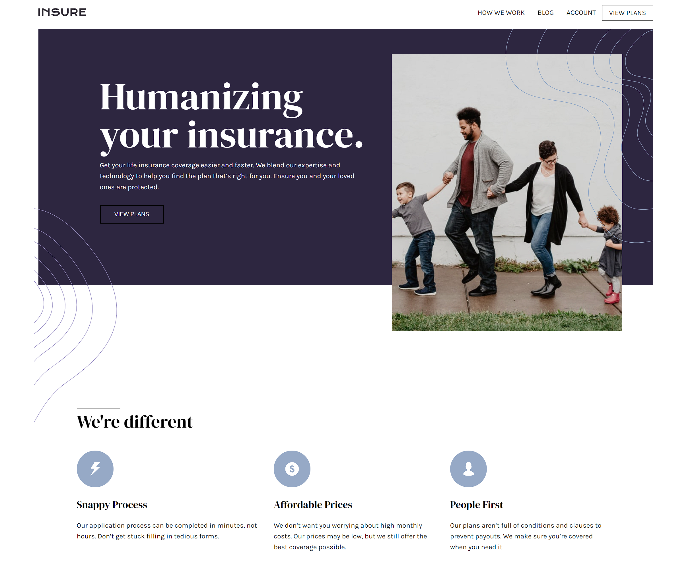

# Frontend Mentor - Insure Lading Page

This is a solution to the [Insure Lading Page challenge on Frontend Mentor](https://www.frontendmentor.io/challenges/insure-landing-page-uTU68JV8). Frontend Mentor challenges help you improve your coding skills by building realistic projects.

## Table of contents

- [Overview](#overview)
  - [The challenge](#the-challenge)
  - [Screenshot](#screenshot)
  - [Links](#links)

### The Challenge

Users should be able to:

- View the optimal layout for the site depending on their device's screen size
- See hover states for all interactive elements on the page

### Screenshot

### Links

- Solution URL: [Frontend Mentor Solution](https://www.frontendmentor.io/solutions/landing-page-built-using-vanilla-js-html-and-css-Qzmm0v6fM)
- Live Site URL: [Vercel Link](https://insure-landing-page-six-sepia.vercel.app/)
